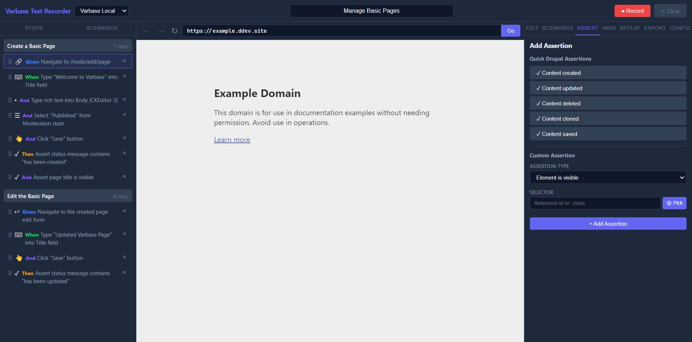

# Assertions

Assertions turn recorded interactions into meaningful automated checks.

## Quick Drupal Templates

The app provides one-click status-message assertions for:

- created
- updated
- deleted
- cloned
- saved

These use Drupal-aware selectors and message matching patterns.

## Custom Assertion Types

You can create assertions for:

- Element visibility
- Element text content
- URL content
- Element existence
- Element non-existence
- Status messages

## Picking Elements For Assertions

Use the `⊕ Pick` button to select an element directly from the live page. The app will store the best selector and, if necessary, the iframe frame path.

## Assertions Inside Iframes

If the target element lives inside a same-origin iframe:

1. Start pick mode.
2. Click the iframe to enter it.
3. Drill into nested frames if needed.
4. Pick the target element.

The resulting assertion stores the `framePath` and uses it in replay and generated Playwright code.

## When To Use Each Assertion

- Use `assert_visible` for user-facing presence.
- Use `assert_exists` for DOM-only presence regardless of visibility.
- Use `assert_text` for content confirmation.
- Use `assert_url` for redirect and route checks.
- Use `assert_status_message` for Drupal save or delete outcomes.
