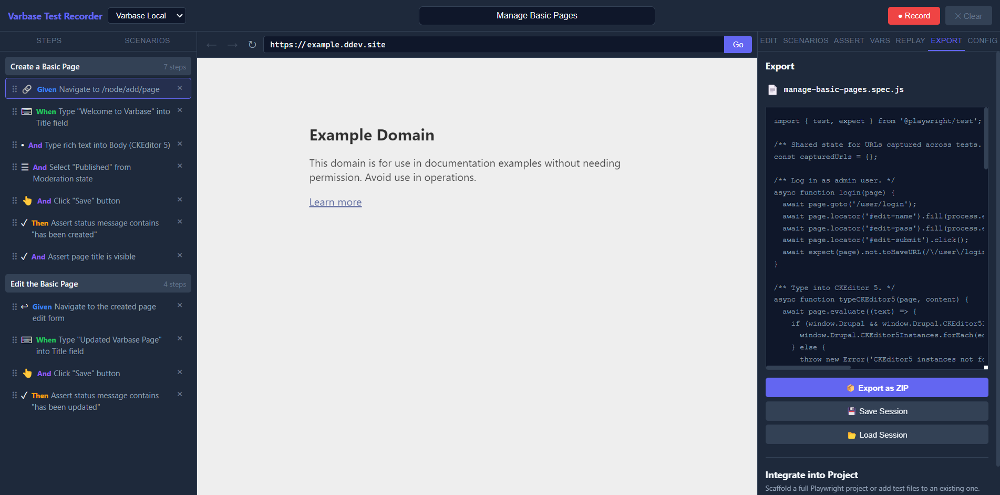

# Code Generation

The generator produces Playwright Test specs from recorded scenarios.



## Output Format

Generated files use `.spec.js` and standard Playwright `test` syntax.

## Included Helpers

Depending on the actions present and generation options, the generator can include helpers for:

- Login
- Save button handling
- CKEditor 5 interaction
- Media library upload flow
- Drupal status message checks
- Dropbutton actions

The login helper is conditional. If login generation is disabled, no login helper or login `beforeEach` block is added.

Drupal-specific helpers are emitted only when the recorded actions require them.

## Iframe Output

When an action contains `framePath`, the generator builds a locator chain like:

```js
page.frameLocator('iframe').nth(0).frameLocator('iframe').nth(2).locator('#target')
```

## CRUD Templates

Optional generated follow-up specs include:

- Edit content
- Delete content
- Clone content

These are useful for content types that follow standard Drupal admin flows.

## Variables And Captured URLs

Dynamic values such as saved node URLs can be captured and reused later in the same serial test suite.

## Generator Advice

- Keep selectors semantic where possible.
- Use replay to validate before export.
- Review generated helpers before committing into a production test suite, especially if your target is not a Drupal-based application.
