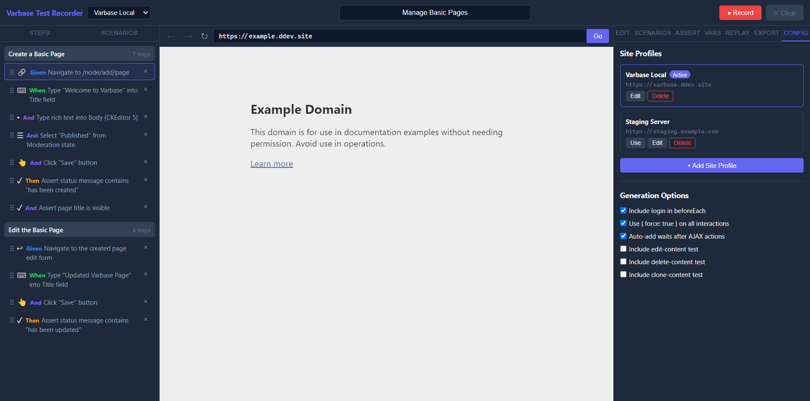

# Configuration

Configuration lives in the `Config` tab and persists in local storage.

## Site Profiles

Each profile can define:

- Profile name
- Base URL
- Login path
- Username selector
- Password selector
- Submit selector

This allows switching between multiple Drupal environments or content stacks. Login path and login selectors are optional if the site does not require authentication or authentication is handled elsewhere.

## Generation Options

Available toggles include:

- Include login in `beforeEach`
- Use forced clicks and fills
- Auto-add waits after AJAX-like operations
- Include edit-content test
- Include delete-content test
- Include clone-content test

`Include login in beforeEach` should be enabled only when the generated suite needs to authenticate before each scenario. Disable it when login is not needed or when your project uses a different auth setup.

## Recommended Setup

- Use one profile per environment.
- Keep selectors aligned with your actual login form when you plan to automate login.
- Turn off generated CRUD templates if your target project uses custom workflows.
