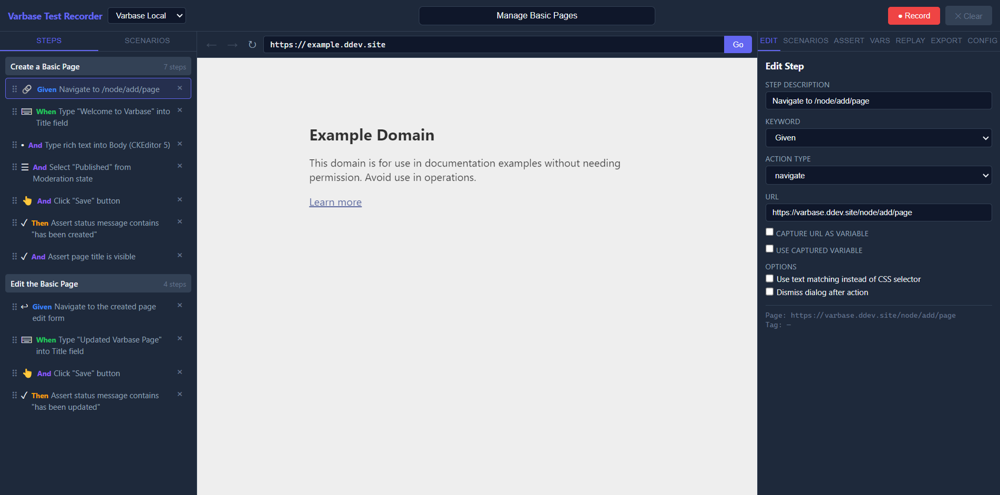

# Recording Guide

The recording engine lives in the webview preload and emits structured actions to the React app.

The recorder works best on Drupal and Varbase sites because it includes framework-aware shortcuts and pattern detection. It can still record generic websites, but Drupal-specific conveniences simply will not apply.

## What Gets Recorded

The recorder supports:

- Navigations
- Clicks
- Text input
- Select field changes
- Checkbox and radio toggles
- File uploads
- Form submits
- CKEditor 5 edits
- Media library interactions
- Dialog clicks
- Dropbutton actions
- Tabledrag operations
- Explicit waits
- URL capture and reuse
- Assertions

## Noise Reduction Rules

The recorder intentionally skips noisy interactions such as:

- Label clicks that only focus a field
- Clicks immediately followed by typing into the same input
- Redundant navigation after a recent click
- Login page boilerplate routes that are better handled in test setup when login automation is enabled

## Selector Strategy

Selectors are generated using a priority-based strategy:

1. Stable ID
2. `data-drupal-selector`
3. `name`
4. Associated label
5. Visible text for buttons and links
6. Compact CSS path

## Drupal-Specific Detection

The recorder recognizes common Drupal and Varbase interfaces:

- Node add, view, edit, delete, clone, and layout pages
- Admin content and structure routes
- CKEditor 5 fields
- Media library buttons
- Dropbuttons
- jQuery UI dialogs
- Autocomplete menus
- Tabledrag handles
- Status messages

## Recording Tips

- Record one clean business flow at a time.
- Let the app generate selectors first, then refine only unstable ones.
- Add assertions after critical saves, redirects, or dialogs.
- Use replay before export.
- Prefer semantic fields and visible button text in your Drupal UI when possible. On non-Drupal targets, the same selector principles still help keep generated tests readable.

## Related Guides

- [Scenario Management](scenario-management.md)
- [Assertions](assertions.md)
- [Replay](replay.md)
