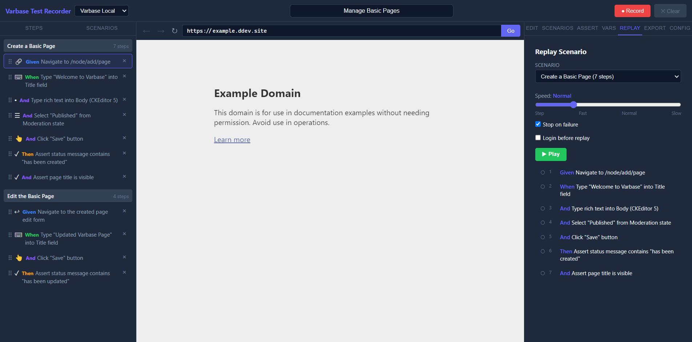

# Replay

Replay validates recorded scenarios directly inside the app before export.

## Replay Modes

- Continuous replay with adjustable speed
- Step-by-step mode when speed is set to zero

## Controls

- Play
- Pause
- Resume
- Stop
- Step forward
- Stop on failure
- Login before replay

`Login before replay` is optional and should only be enabled when the replay flow needs an authenticated starting point.

## How It Works

The renderer orchestrates navigation and timing. The webview preload executes DOM interactions and reports step results back to the UI. After each navigation, replay waits for the new page preload to become ready before sending the next action.

## Failure Handling

A failed replay step records:

- The step ID
- Failed status
- Error message
- Optional warnings for partial or manual operations

If `Stop on failure` is enabled, replay pauses immediately so you can inspect the page and adjust the step.

## Replay Tips

- Replay after major selector edits.
- Use step mode for flaky flows.
- Disable login replay if you are already on an authenticated session.
- For navigation-dependent flows, confirm the correct base URL profile is selected.
