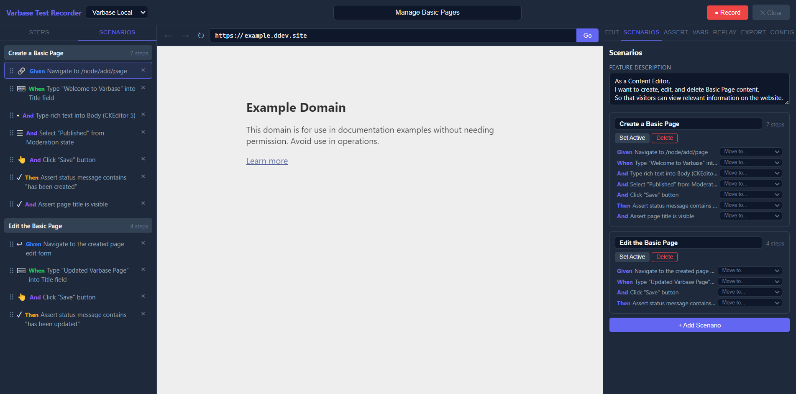

# Scenario Management

Scenarios let you break a feature into testable flows while keeping all steps in one recording session.

## What You Can Do

- Rename scenarios
- Create additional scenarios
- Set the active scenario for new recordings
- Move steps between scenarios
- Reorder steps visually
- Review keyword assignments such as `Given`, `When`, `Then`, and `And`

## Feature Description

The `Scenarios` tab includes a feature description area inspired by Gherkin style. Use it to document user intent and business value for the generated spec.

## Step Editing Workflow

After recording, select any step and use the `Edit` tab to modify:

- Description text
- Keyword
- Action type
- Selector and selector strategy
- Value or expected text
- URL
- Variable capture or variable use
- Wait timing
- Extra options such as text matching and dialog dismissal

## Best Practices

- Keep scenarios focused on one objective.
- Split create, edit, delete, and clone flows into separate scenarios when they can run independently.
- Use assertions to clearly mark expected outcomes.
- Review reordered steps with replay before exporting.
