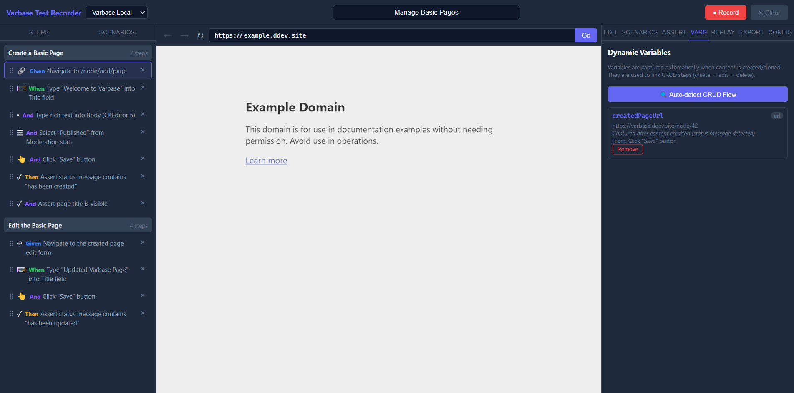

# Variables

The **Vars** tab tracks dynamic values captured during recording, such as content URLs and node IDs. These variables link CRUD steps so that a create-then-edit-then-delete flow can reference the same entity across scenarios.

## How Variables Are Captured

When you create or clone content in the embedded browser, the recorder detects the resulting page URL and stores it as a variable. This happens automatically when the app recognizes a Drupal node view or layout page after a status message.

## What Each Variable Shows

- **Name** — a label like `createdPageUrl` used to reference this value in later steps.
- **Type** — typically `url` for captured page addresses.
- **Value** — the actual captured URL or identifier.
- **Reason** — why the variable was captured (for example, "Captured after content creation").
- **Source action** — the recorded step that triggered the capture.

## Using Variables In Steps

The `use_captured_url` action type lets a later step navigate to a URL derived from a captured variable. For example, after creating a node, you can add a step that navigates to `createdPageUrl + /edit` to test the edit form.

In generated Playwright output, captured URLs become JavaScript variables that are assigned during the create step and reused in subsequent `goto()` calls.

## Auto-Detection

Click **Auto-detect CRUD Flow** in the Vars panel to scan all recorded actions for content creation patterns and capture any URLs that the automatic detection may have missed during recording.

## Managing Variables

- Variables can be removed individually from the panel.
- Removing a variable does not delete the recorded step that produced it, but any `use_captured_url` steps referencing that variable will no longer resolve correctly in generated code.
